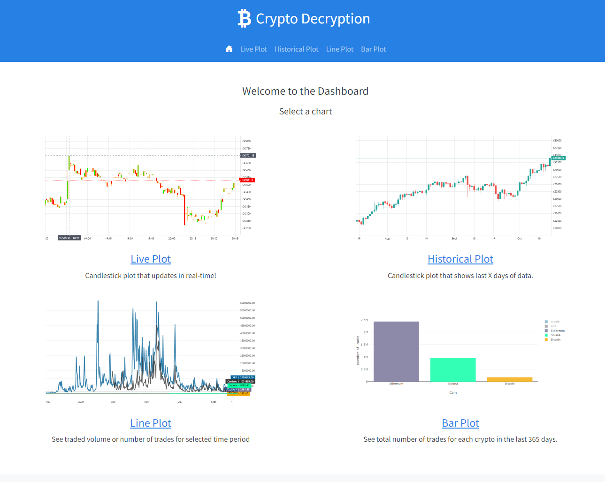

# Project: Crypto Decryption - Cryptocurrency Dashboard

### Deployed App
[Click Here to view deployed app](https://crypto-decryption-project3.herokuapp.com/)
 
 ## Contents

* [Project Proposal](#project_header)
* [Project Retrospective](#project_retrospective)

## Project Proposal

### Project Overview

The project focuses on cryptocurrencies and it provides the users with a tool which allows them to observe insights into the top seven* cryptocurrencies. 
The focus is to enable the users to use the visualisations presented to find out more about these selected cryptocurrencies and their recorded past. 

*The top seven would be based on popularity from an API search. 

### Data Sources

The data used in the dashboard will either be pulled from Binance or Coin Gecko's APIs.

[Binance API](https://binance-docs.github.io/apidocs/spot/en/#general-info)

[CoinGecko API](https://www.coingecko.com/en/api)

### Overview of Visualisations 

The goal is to visualize the following three points: 

* Top seven crypto plot - gives user overview of data (data range needs to be specified)
* [Bar Chart Race](https://observablehq.com/@d3/bar-chart-race) to show all seven cryptos over the past two years. (Replay button / filter for data to race) 
* [Candlestick plot](https://www.amcharts.com/demos/stock-chart-candlesticks) last 20 days for a cryptocurrency (shows alphabetically first crypto, dropdown to choose others).

### Task Breakdown

**Flask Application (Python)**

* API call for top seven crypto.
* Return JSON to be read by Java Script.

**Java Script**

* Reads in data created by Flask Application
* Data Visualisation

**HTML**

* Website Layout

## Project Retrospective

Quickly into the project I decided on using Binance as the API of choice. I found the functionality and ease of use with Websocket higher with Binance. I could request to the API with two separate queries - one to collate a year's worth of data daily, and a second to collate a day's worth of data minute by minute. These two separate intervals of data were converted into Pandas dataframes and sqlite databases.

One of the challenges I faced in this project was obtaining the real-time live data. I was initially using Websockets technology inside of python. However, due to the .runforever() function, retrieving data from this program was impossible without preventing all other functions from ceasing. The solution I gave to this was to import my Websockets code into javascript and use javascript to add the live data onto our candlestick plot. 

I finally opted for four visualisations, as I felt this better conveyed the 'story' and informed the users on the cryptocurrencies used. Whilst a racing bar chart was considered, I felt this required a larger range of cryptos to 'race' in order for it to be compelling and not a slower way of displaying information easily shown on a line plot. 

In future iterations of this project, I would focus on a wider range of cryptocurrencies, as the limit of five cryptos did not affect workload. In addition, I would look at potential incorporating a bot to handle requests for improved user functionality.

## View Deployed App

The App is deployed to Heroku
[Click Here to view deployed app](https://crypto-decryption-project3.herokuapp.com/)
